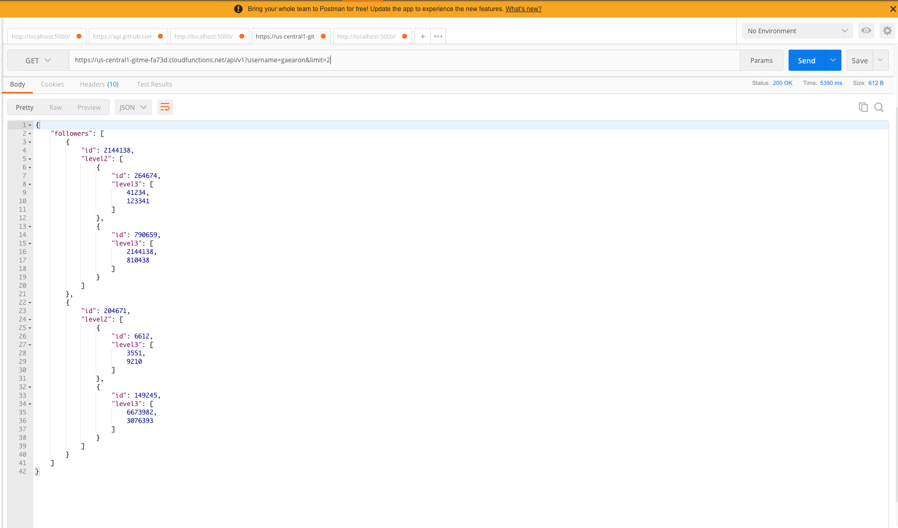

## Technologies
Project is created with:
* Node / Express
* Async / Await with Axios
* Google firebase cloud functions
	
## Test
To run this project<br/>

```
$ curl "https://us-central1-gitme-fa73d.cloudfunctions.net/api/v1?username=gaearon&limit=3" 
```



* Required query parameter - username
* Optional query parameter - 
    <ul>
    <li>limit (max is 5)</li>
    ## Passing self and password will fix rate issues. However, The passwords are not hashed and should be used at your own risk.
    <li>self(your github username)</li>
    <li>password(your github password)</li>
    </ul>
#

# Code 
* Can be found in the functions folder


